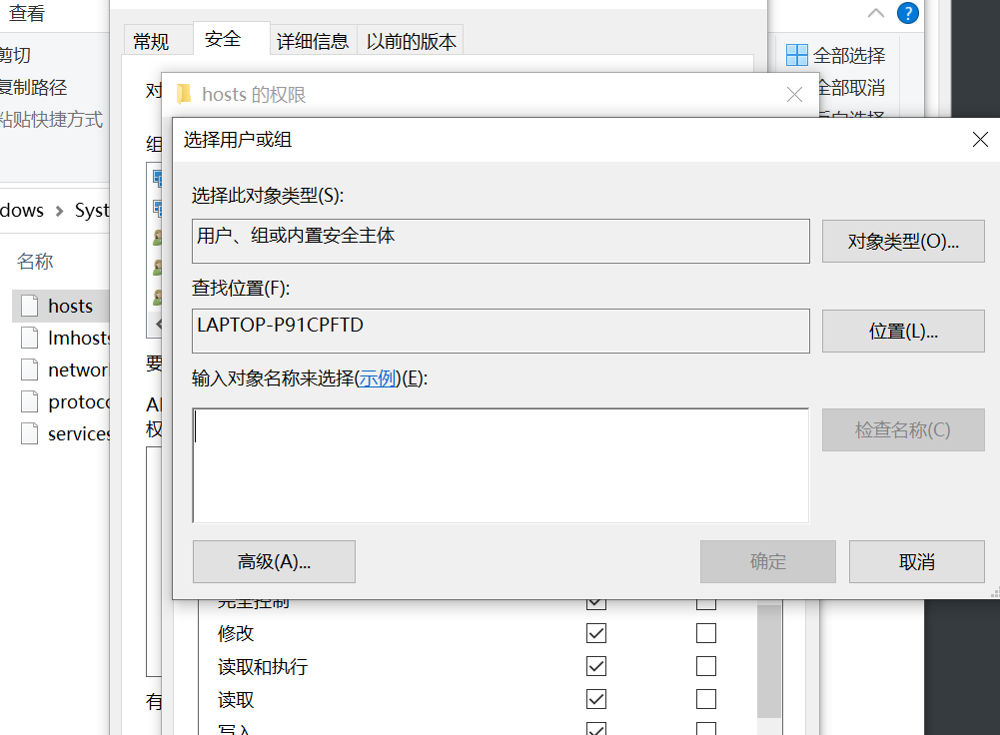

# Linux实验一

## 实验目的  

掌握Ubuntu 20.04版本手动安装过程，学会无人值守安装

## 实验环境

Virtual Box

## 实验内容

1. 下载ubuntu20.04版本镜像
2. 制作focal-init.iso
3. 实现无人值守安装

## 实验步骤

### 手动安装过程

进入官网下载Ubuntu安装镜像iso文件

创建新的虚拟机

设置双网卡

选择镜像

开始安装

已检测到两个网卡

系统正在安装

### 生成focal-nint.iso镜像

配置公私钥对，便于远程传输

复制user-data

对照修改user-data

### Focal Fossa无人值守安装iso

按顺序依次添加虚拟光盘

开始进行无人值守安装

## 问题及解决方法

### 1.无法打开老师的focal-init.iso

### 解决方法

放弃老师的focal-init.iso，自己制作iso镜像

### 2.鼠标进入虚拟机就不见了

### 解决方法一

ctrl+alt键将鼠标调出来 （×）

### 解决方法二

在设置--显示--屏幕--Graphics Controller 里面选择 VBoxVGA  (×)

### 解决方法三

原来大家的鼠标进入虚拟机都消失了，就不去深究这个问题

### 3.无法将虚拟机里的user-data复制到主机

在主机cmd命令中输入命令：*ssh first@192.168.56.101*

输入密码登录进虚拟机，再输：*vim autoinstall-user-data* 即可复制

### 4.无法登录github网站

### 方法一

下载Netch 1.8.1.zip → 右键**以管理员身份运行**netch.exe

订阅--管理订阅链接--添加链接*https://panel.testred.xyz/link/MZqg8ba08167iyqU?sub=1&extend=1* 备注随意设置

订阅--从订阅链接更新服务器

→ 若超时无法更新 → 完全关闭netch.exe → 重复**订阅--从订阅链接更新服务器**的步骤

此方法行不通！

### 方法二：修改hosts文件内容

### 第一步：修改权限

找到C:\Windows\System32\drivers\etc中的hosts文件

右击hosts,打开最后一个选项–>属性，来到下面界面：

编辑--添加

高级--立即查找--找到本机用户添加进去保存--确定

将权限修改为完全控制，并确认保存

### 第二步：修改hosts文件

在记事本打开hosts，在最后一行加上：

*140.82.113.4 github.com
199.232.5.194 github.global.ssl.fastly.net*

保存

### 第三步：刷新DNS

打开cmd，输入命令：*ipconfig* 

### 第四步：登录github.com成功！！

### 5.git pull origin master失败

解决方法：输入 *git config --global http.sslVerify "false"* 

## 坑

1.在手动安装过程中，要注意安装是否完成。当出现*Rboot Now*时，点击该按钮即可完成。无需浪费大量事件等待。

2.图片一定要使用相对路径，且后缀名要小写‘.jpg’，不能大写

3.无人值守一直没安装完，需要去修改源，在user-data里面的源替换成国内的源

4.使用dir查看仓库的文件，下图为提交信息而不是存在的文件

